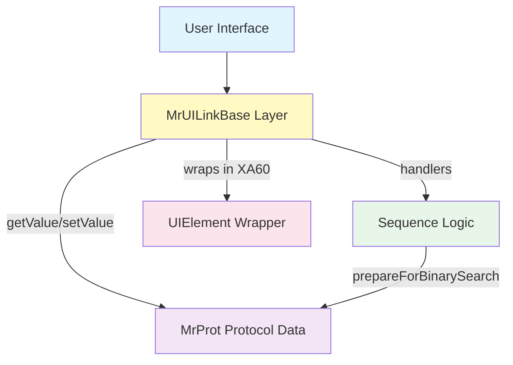
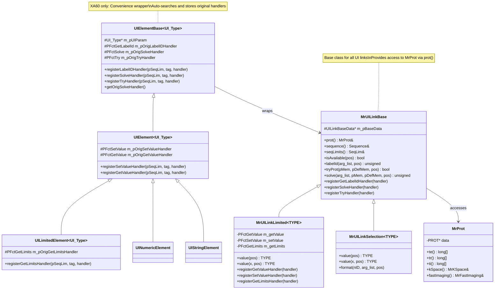
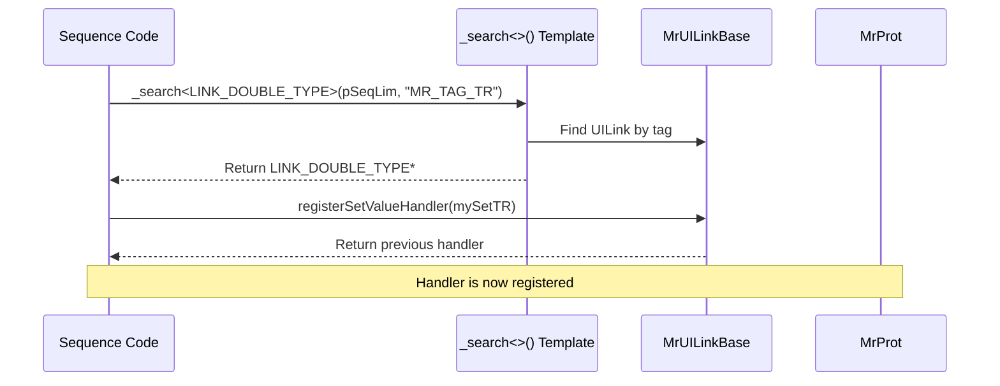
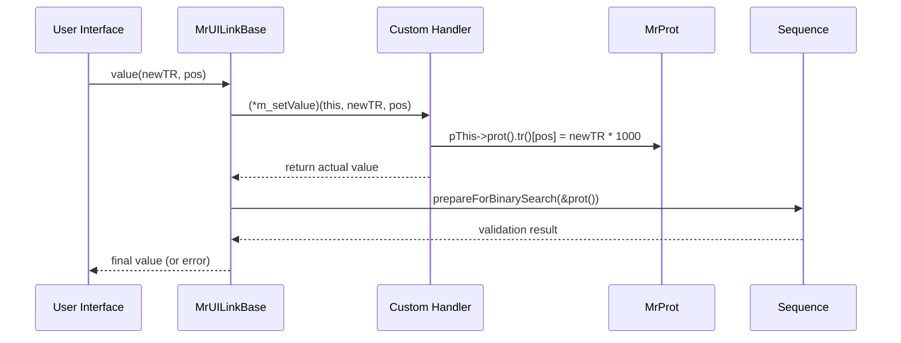
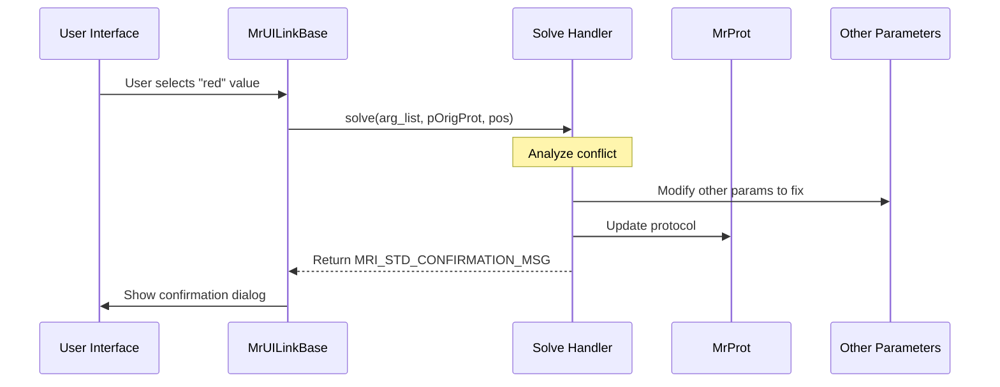

# MRI UI-Protocol Architecture Documentation

## Table of Contents
1. [Overview](#overview)
2. [Architecture Diagram](#architecture-diagram)
3. [Core Components](#core-components)
4. [Class Hierarchy](#class-hierarchy)
5. [Data Flow](#data-flow)
6. [Version Differences (VA25 vs XA60)](#version-differences)
7. [Code Examples](#code-examples)
8. [Key Patterns](#key-patterns)

---

## Overview

The MRI UI-Protocol system implements a **three-layer architecture** for managing MRI scanner protocol parameters:

1. **Protocol Data Layer** (`MrProt`) - Stores actual parameter values
2. **UI Binding Layer** (`MrUILinkBase` and derivatives) - Links UI to protocol data
3. **Convenience Wrapper Layer** (`UIElement` hierarchy - XA60 only) - Simplifies handler management

### Key Design Goals
- **Separation of concerns** between UI, protocol storage, and sequence logic
- **Flexibility** through customizable handler functions
- **Type safety** via C++ templates
- **Handler chaining** to extend behavior without replacing it

---

## Architecture Diagram

### Overall System Architecture



### Class Hierarchy Diagram



---

## Core Components

### 1. MrProt - Protocol Data Container

**Location**: `MrServers/MrProtSrv/MrProt/MrProt.h`

**Purpose**: C++ wrapper around the C struct `PROT` that stores all protocol parameter values.

**Key Features**:
- Wraps the binary `PROT` structure
- Provides type-safe accessors
- Contains all MRI acquisition parameters

**Key Methods**:
```cpp
class MrProt {
    friend class MrUILinkBase;  // UILink can access protocol

    // Timing parameters (in microseconds)
    MrProtArray<long>& te();     // Echo time array
    MrProtArray<long>& tr();     // Repetition time array
    MrProtArray<long>& ti();     // Inversion time array

    // K-space and imaging parameters
    MrKSpace& kSpace();
    MrFastImaging& fastImaging();
    MrPreparationPulses& preparationPulses();

    // Reconstruction
    SEQ::ReconstructionMode reconstructionMode() const;
    SEQ::ReconstructionMode reconstructionMode(SEQ::ReconstructionMode value);
};
```

**File References**:
- Definition: `/n4/pkg/MrServers/MrProtSrv/MrProt/MrProt.h:223`
- C struct: `/n4/pkg/MrServers/MrProtSrv/MrProt/prot.h`

---

### 2. MrUILinkBase - UI Binding Layer

**Location**: `MrServers/MrProtSrv/MrProtocol/libUILink/UILinkBase.h`

**Purpose**: Bridge between UI and protocol data. Each parameter has an associated UILink object.

**Key Connection**:
```cpp
class MrUILinkBase {
    // Critical: Each UILink has reference to protocol!
    const MrProt& prot() const;  // Line 486
    MrProt& prot();              // Line 490

    Sequence& sequence() const;   // Access to sequence logic
    SeqLim& seqLimits() const;    // Access to limits
};
```

**Handler Function Types**:
```cpp
// Handler for getting parameter label
typedef unsigned (*PFctGetLabelId)(
    MYTYPE* const pThis,
    char* arg_list[],
    INDEX_TYPE lPos
);

// Handler for parameter availability
typedef bool (*PFctIsAvailable)(
    MYTYPE* const pThis,
    INDEX_TYPE lPos
);

// Handler for conflict resolution
typedef unsigned (*PFctSolve)(
    MYTYPE* const pThis,
    char* arg_list[],
    const void* pClientMem,
    const MrProt* pOrigProt,
    INDEX_TYPE lPos
);

// Handler for validation
typedef bool (*PFctTry)(
    MYTYPE* const pThis,
    void* pClientMem,
    const MrProt* pOrigProt,
    INDEX_TYPE lPos
);
```

**File References**:
- Base class: `/n4/pkg/MrServers/MrProtSrv/MrProtocol/libUILink/UILinkBase.h:85`
- Handler definitions: Lines 154-388

---

### 3. MrUILinkLimited - Typed Parameters

**Location**: `MrServers/MrProtSrv/MrProtocol/libUILink/UILinkLimited.h`

**Purpose**: Template class for numeric parameters with limits.

**Type Definitions**:
```cpp
typedef MrUILinkLimited<long>   LINK_LONG_TYPE;     // Line 674
typedef MrUILinkLimited<double> LINK_DOUBLE_TYPE;   // Line 675
typedef MrUILinkSelection<unsigned> LINK_SELECTION_TYPE;  // UILinkSelection.h:528
typedef MrUILinkSelection<bool>     LINK_BOOL_TYPE;       // UILinkSelection.h:529
```

**Value Handlers**:
```cpp
template<class TYPE>
class MrUILinkLimited : public MrUILinkBase {
    // Function pointer types
    typedef TYPE (*PFctGetValue)(MYTYPE* const pThis, INDEX_TYPE lPos);
    typedef TYPE (*PFctSetValue)(MYTYPE* const pThis, TYPE newVal, INDEX_TYPE lPos);
    typedef bool (*PFctGetLimits)(
        MYTYPE* const pThis,
        std::vector<MrLimit<TYPE>>& rLimits,
        unsigned long& rulVerify,
        long lPos
    );

private:
    PFctGetValue m_getValue;  // Line 214
    PFctSetValue m_setValue;  // Line 215
    PFctGetLimits m_getLimits;

public:
    // Get parameter value
    TYPE value(INDEX_TYPE pos) const;  // Line 522

    // Set parameter value (with validation)
    TYPE value(TYPE x, INDEX_TYPE pos);  // Line 571
};
```

**How Values Flow**:
```cpp
// Getting a value - Line 522-534
TYPE MrUILinkLimited<TYPE>::value(INDEX_TYPE pos) const {
    if(m_getValue)
        return (*m_getValue)(this, pos);  // Call registered handler
    // Otherwise read directly from protocol
}

// Setting a value - Line 571+
TYPE MrUILinkLimited<TYPE>::value(TYPE x, INDEX_TYPE pos) {
    // Validates limits, calls binary search if needed
    if(m_setValue)
        (*m_setValue)(this, x, pos);  // Call registered handler
    // Updates protocol
}
```

**File References**:
- Template definition: `/n4/pkg/MrServers/MrProtSrv/MrProtocol/libUILink/UILinkLimited.h:80`

---

### 4. UIElement Hierarchy (XA60 Only)

**Location**: `XA60/MrProtSrv/Domain/MrProtocol/libUICtrl/UICtrl.h`

**Purpose**: Convenience wrapper that simplifies handler registration and management.

#### UIElementBase<UI_Type>

**Core Functionality**: Stores original handlers and provides simplified registration.

```cpp
template <class UI_Type>
class UIElementBase {
protected:
    UI_Type* m_pUIParam;  // Pointer to actual UILink

    // Original handler storage
    typename UI_Type::PFctGetLabelId     m_pOrigLabelIDHandler;
    typename UI_Type::PFctGetToolTipId   m_pOrigToolTipHandler;
    typename UI_Type::PFctIsAvailable    m_pOrigIsAvailableHandler;
    typename UI_Type::PFctStoreInMemory  m_pOrigStoreInMemoryHandler;
    typename UI_Type::PFctRecallMemory   m_pOrigRecallMemoryHandler;
    typename UI_Type::PFctClearMemory    m_pOrigClearMemoryHandler;
    typename UI_Type::PFctSolve          m_pOrigSolveHandler;
    typename UI_Type::PFctTry            m_pOrigTryHandler;

public:
    UIElementBase() : m_pUIParam(NULL), /* ... all NULL ... */ {}

    // Simplified registration - Line 162
    typename UI_Type::PFctGetLabelId registerLabelIDHandler(
        SeqLim* pSeqLim,
        const char *pszTag,
        typename UI_Type::PFctGetLabelId pLabelIDHandler)
    {
        // Auto-search for parameter if needed
        if (!m_pUIParam) {
            m_pUIParam = _search<UI_Type>(pSeqLim, pszTag);
        }

        // Register and store original
        if (m_pUIParam) {
            typename UI_Type::PFctGetLabelId pPrevHandler =
                m_pUIParam->registerGetLabelIdHandler(pLabelIDHandler);

            if (pPrevHandler != pLabelIDHandler) {
                m_pOrigLabelIDHandler = pPrevHandler;  // Store it!
            }

            return m_pOrigLabelIDHandler;
        }
        return NULL;
    }

    // Similar methods for all handler types...
    // registerToolTipHandler(), registerIsAvailableHandler(), etc.
};
```

**File Reference**: `/n4/pkg/XA60/MrProtSrv/Domain/MrProtocol/libUICtrl/UICtrl.h:117`

#### UIElement<UI_Type> : UIElementBase

**Adds**: Value-specific handlers (Get/Set).

```cpp
template <class UI_Type>
class UIElement : public UIElementBase<UI_Type> {
protected:
    typename UI_Type::PFctSetValue m_pOrigSetValueHandler;  // Line 1995
    typename UI_Type::PFctGetValue m_pOrigGetValueHandler;  // Line 1996

public:
    typename UI_Type::PFctSetValue registerSetValueHandler(
        SeqLim* pSeqLim,
        const char *pszTag,
        typename UI_Type::PFctSetValue pSetValueHandler);

    typename UI_Type::PFctGetValue registerGetValueHandler(
        SeqLim* pSeqLim,
        const char *pszTag,
        typename UI_Type::PFctGetValue pGetValueHandler);
};
```

**File Reference**: `/n4/pkg/XA60/MrProtSrv/Domain/MrProtocol/libUICtrl/UICtrl.h:1611`

#### UILimitedElement<UI_Type> : UIElement

**Adds**: Limits handler management.

```cpp
template <class UI_Type>
class UILimitedElement : public UIElement<UI_Type> {
protected:
    typename UI_Type::PFctGetLimits m_pOrigGetLimitsHandler;

public:
    UILimitedElement() : m_pOrigGetLimitsHandler(NULL) {}

    typename UI_Type::PFctGetLimits registerGetLimitsHandler(
        SeqLim* pSeqLim,
        const char *pszTag,
        typename UI_Type::PFctGetLimits pSetGetLimitsHandler);
};
```

**File Reference**: `/n4/pkg/XA60/MrProtSrv/Domain/MrProtocol/libUICtrl/UICtrl.h:2021`

#### Specialized Elements

```cpp
// For numeric types (doubles, longs)
template <class UI_Type>
class UINumericElement : public UIElement<UI_Type> {};  // Line 2002

// For string types
template <class UI_Type>
class UIStringElement : public UIElement<UI_Type> {};   // Line 2011
```

---

## Data Flow

### Parameter Search and Registration



### Value Change Flow



### Solve Handler Flow (Conflict Resolution)



---

## Version Differences

### VA25 Architecture

**Characteristics**:
- Direct use of `MrUILinkBase` and derivatives
- Manual handler registration
- Explicit `_search<>()` template calls
- More verbose sequence code

**Example VA25 Code**:
```cpp
// In sequence init
LINK_DOUBLE_TYPE* pTR = _search<LINK_DOUBLE_TYPE>(pSeqLim, MR_TAG_TR);
if (pTR) {
    pTR->registerSetValueHandler(mySetTR);
    pTR->registerGetLimitsHandler(myGetTRLimits);
    pTR->registerSolveHandler(mySolveTR);
}
```

**File Location**: `/n4/pkg/MrServers/MrImaging/libUICtrl/`

### XA60 Architecture

**Enhancements**:
- Adds `UIElement` wrapper hierarchy
- Auto-searching of parameters
- Automatic storage of original handlers
- Cleaner, more maintainable code

**Example XA60 Code**:
```cpp
// Sequence class members
class MySequence {
    UILimitedElement<LINK_DOUBLE_TYPE> m_TR;

    NLS_STATUS fSEQInit(SeqLim* pSeqLim) {
        // Single call - auto-searches and registers!
        m_TR.registerSetValueHandler(pSeqLim, MR_TAG_TR, mySetTR);
        m_TR.registerGetLimitsHandler(pSeqLim, MR_TAG_TR, myGetTRLimits);
        m_TR.registerSolveHandler(pSeqLim, MR_TAG_TR, mySolveTR);

        // Access originals if needed for chaining
        auto origSolve = m_TR.getOrigSolveHandler();
    }
};
```

**File Location**: `/n4/pkg/XA60/MrProtSrv/Domain/MrProtocol/libUICtrl/`

---

## Code Examples

### Example 1: TR Parameter Handler (VA25 Style)

```cpp
// File: MySequence.cpp
#include "MrServers/MrProtSrv/MrProtocol/libUILink/UILinkLimited.h"

// Custom TR setter - converts ms to μs
static double setTR(LINK_DOUBLE_TYPE* pThis, double newVal_ms, long pos) {
    // Enforce minimum
    if (newVal_ms < 10.0) newVal_ms = 10.0;

    // Convert ms to μs and store in protocol
    pThis->prot().tr()[pos] = static_cast<long>(newVal_ms * 1000.0 + 0.5);

    // Return actual value in ms
    return pThis->prot().tr()[pos] / 1000.0;
}

// Custom TR getter
static double getTR(LINK_DOUBLE_TYPE* pThis, long pos) {
    // Convert μs to ms
    return pThis->prot().tr()[pos] / 1000.0;
}

NLS_STATUS fSEQInit(SeqLim* pSeqLim) {
    // Search for TR parameter
    LINK_DOUBLE_TYPE* pTR = _search<LINK_DOUBLE_TYPE>(pSeqLim, MR_TAG_TR);

    if (pTR) {
        pTR->registerSetValueHandler(setTR);
        pTR->registerGetValueHandler(getTR);
    }

    return SEQU_NORMAL;
}
```

**Reference**: Similar pattern in `/n4/pkg/MrServers/MrImaging/libUICtrl/UICtrl.cpp:494`

### Example 2: Solve Handler for Segments Conflict

```cpp
// From UICtrl.cpp - fUICSolveSegmentsConflict
unsigned fUICSolveSegmentsConflict(
    LINK_LONG_TYPE* const _this,
    char** arg_list,
    const void* pToAddMemory,
    const MrProt* pOrigProt,
    long lIndex,
    pfGetMinTiming pfGetMinTE,
    pfGetMinTiming pfGetMinTI,
    pfGetMinTiming pfGetMinTR
) {
    MrProt* pNewProt = &_this->prot();

    // User selected 1 segment with IR pulse active - conflict!
    if ((pNewProt->fastImaging().segments() <= 1) &&
        (pNewProt->preparationPulses().inversion() != SEQ::INVERSION_OFF)) {

        // Format confirmation message if showing to user
        if (arg_list) {
            arg_list[0]  = (char*) MRI_STD_SEGMENTS_LABEL;
            arg_list[20] = (char*) MRI_STD_MAGN_PREP_LABEL;
            arg_list[30] = (char*) MRI_STD_MAGN_PREP_NONE;
            // ... more formatting ...
        }

        // Fix the conflict: turn off inversion
        LINK_SELECTION_TYPE* pInversionMode =
            _search<LINK_SELECTION_TYPE>(_this, MR_TAG_INVERSION);

        if (pInversionMode && pInversionMode->isEditable(0)) {
            pInversionMode->value(MRI_STD_MAGN_PREP_NONE, 0);
        }

        // Validate the fix
        if (_this->tryProt((void*)pToAddMemory, pOrigProt, lIndex)) {
            return MRI_STD_CONFIRMATION_MSG;  // Success!
        }
    }

    return 0;  // Can't solve
}
```

**Reference**: `/n4/pkg/MrServers/MrImaging/libUICtrl/UICtrl.cpp:991`

### Example 3: Using UIElement Wrapper (XA60 Style)

```cpp
// File: MySequence.h (XA60)
#include "MrProtSrv/Domain/MrProtocol/libUICtrl/UICtrl.h"

class MySequence {
private:
    // Member variables - wrappers for each parameter
    UILimitedElement<LINK_DOUBLE_TYPE> m_TR;
    UILimitedElement<LINK_DOUBLE_TYPE> m_TE;
    UIElement<LINK_LONG_TYPE> m_Segments;

    // Handler functions
    static double setTR(LINK_DOUBLE_TYPE* pThis, double val, long pos) {
        if (val < 10.0) val = 10.0;
        pThis->prot().tr()[pos] = static_cast<long>(val * 1000.0 + 0.5);
        return pThis->prot().tr()[pos] / 1000.0;
    }

    static unsigned solveTR(
        LINK_DOUBLE_TYPE* pThis,
        char** arg_list,
        const void* pMem,
        const MrProt* pOrigProt,
        long pos
    ) {
        // Chain to original if exists
        auto origSolve = m_TR.getOrigSolveHandler();
        if (origSolve) {
            unsigned result = (*origSolve)(pThis, arg_list, pMem, pOrigProt, pos);
            if (result) return result;
        }

        // Custom solve logic
        // ...
        return MRI_STD_CONFIRMATION_MSG;
    }

public:
    NLS_STATUS fSEQInit(SeqLim* pSeqLim) {
        // Clean, simple registration - auto-searches and stores originals
        m_TR.registerSetValueHandler(pSeqLim, MR_TAG_TR, &MySequence::setTR);
        m_TR.registerSolveHandler(pSeqLim, MR_TAG_TR, &MySequence::solveTR);

        m_Segments.registerSetValueHandler(pSeqLim, MR_TAG_SEGMENTS, &MySequence::setSegments);

        return SEQU_NORMAL;
    }
};
```

### Example 4: Binary Search with Handlers

```cpp
// Standard solve handler using binary search
// From UICtrl.cpp:454
unsigned fUICStandardSolveHandler(
    MrUILinkBase* const _this,
    char** arg_list,
    const MrProt* pOrigProt,
    pfGetMinTiming pfGetMinTE,
    pfGetMinTiming pfGetMinTI,
    pfGetMinTiming pfGetMinTR,
    long lFirstLine,
    long* plTryAlternativeTE
) {
    MrProt* pNewProt = &_this->prot();
    const SeqLim* pSeqLim = &_this->seqLimits();
    Sequence* pSeq = &_this->sequence();

    long alTEMin[K_NO_TIME_ELEMENTS];
    long lTRMin = 0;
    long lTIMin = 0;

    // Calculate minimum TR
    if (pfGetMinTR) {
        if (!pfGetMinTR(pNewProt, (SeqLim*)pSeqLim, pSeq, &lTRMin)) {
            return 0;
        }
        double dTRMin_ms = lTRMin / 1000.0;
        fUICSetWithinLimits(_this, dTRMin_ms, MR_TAG_TR,
                            UIC_SET_WITHIN_LIMITS_ROUNDUP, 0);
    }

    // Calculate minimum TE for each contrast
    if (pfGetMinTE) {
        for (long MyEL = 0; MyEL < pNewProt->contrasts(); MyEL++) {
            if (!pfGetMinTE(pNewProt, (SeqLim*)pSeqLim, pSeq, &alTEMin[MyEL])) {
                return 0;
            }
            double dTEMin_ms = alTEMin[MyEL] / 1000.0;
            fUICSetWithinLimits(_this, dTEMin_ms, MR_TAG_TE,
                                UIC_SET_WITHIN_LIMITS_ROUNDUP, MyEL);
        }
    }

    // Validate the new protocol
    if (!pSeq->prepareForBinarySearch(pNewProt)) {
        return 0;
    }

    // Format confirmation message
    if (arg_list) {
        fUICFormatTETRTIChanges(_this, arg_list, NULL, pOrigProt, lFirstLine);
    }

    return MRI_STD_CONFIRMATION_MSG;
}
```

**Reference**: `/n4/pkg/MrServers/MrImaging/libUICtrl/UICtrl.cpp:454`

---

## Key Patterns

### 1. Handler Registration Pattern

**Purpose**: Register custom logic for parameter operations.

```cpp
// Pattern: Store original, register new, return original for chaining
PFctSetValue pOrigSetValueHandler =
    pUILink->registerSetValueHandler(myCustomHandler);

// Can now chain handlers:
static TYPE myCustomHandler(UILink* pThis, TYPE val, long pos) {
    // Pre-processing
    val = preProcess(val);

    // Call original if exists
    if (pOrigSetValueHandler) {
        val = (*pOrigSetValueHandler)(pThis, val, pos);
    }

    // Post-processing
    return postProcess(val);
}
```

### 2. Search and Register Pattern (VA25)

```cpp
// Pattern: Search for parameter, check existence, register handlers
LINK_DOUBLE_TYPE* pParam = _search<LINK_DOUBLE_TYPE>(pSeqLim, MR_TAG_XXX);
if (pParam) {
    pParam->registerSetValueHandler(myHandler);
    pParam->registerGetLimitsHandler(myLimitsHandler);
    // ... more handlers ...
}
```

### 3. Auto-Registration Pattern (XA60)

```cpp
// Pattern: UIElement does search and storage automatically
UILimitedElement<LINK_DOUBLE_TYPE> m_Param;

// In init - one call does it all
m_Param.registerSetValueHandler(pSeqLim, MR_TAG_XXX, myHandler);
// Automatic: search, register, store original
```

### 4. Solve Handler Pattern

```cpp
unsigned mySolveHandler(
    LINK_TYPE* const pThis,
    char** arg_list,
    const void* pMem,
    const MrProt* pOrigProt,
    long pos
) {
    MrProt* pNewProt = &pThis->prot();

    // 1. Detect conflict
    if (/* conflict detected */) {

        // 2. Format user message (if showing UI)
        if (arg_list) {
            arg_list[0]  = (char*) MRI_STD_XXX_LABEL;
            arg_list[20] = (char*) MRI_STD_YYY_LABEL;
            // ...
        }

        // 3. Fix by modifying other parameters
        LINK_TYPE* pOtherParam = _search<LINK_TYPE>(pThis, MR_TAG_YYY);
        if (pOtherParam) {
            pOtherParam->value(newValue, 0);
        }

        // 4. Validate fix
        if (pThis->tryProt((void*)pMem, pOrigProt, pos)) {
            return MRI_STD_CONFIRMATION_MSG;  // Success
        }
    }

    return 0;  // Can't solve
}
```

### 5. Value Conversion Pattern

```cpp
// Pattern: UI works in user units (ms), protocol stores in system units (μs)
static double getTR(LINK_DOUBLE_TYPE* pThis, long pos) {
    return pThis->prot().tr()[pos] / 1000.0;  // μs → ms
}

static double setTR(LINK_DOUBLE_TYPE* pThis, double val_ms, long pos) {
    pThis->prot().tr()[pos] = static_cast<long>(val_ms * 1000.0 + 0.5);  // ms → μs
    return pThis->prot().tr()[pos] / 1000.0;  // Return in ms
}
```

### 6. Limits Handler Pattern

```cpp
static bool getTRLimits(
    LINK_DOUBLE_TYPE* const pThis,
    std::vector<MrLimitDouble>& rLimitVector,
    unsigned long& rulVerify,
    long lPos
) {
    MrProt* pProt = &pThis->prot();

    // Define limit intervals in ms
    MrLimitDouble limit1, limit2;
    limit1.setEqualSpaced(10.0, 100.0, 0.1);   // 10-100ms, step 0.1
    limit2.setEqualSpaced(100.0, 10000.0, 1.0); // 100-10000ms, step 1.0

    rLimitVector.clear();
    rLimitVector.push_back(limit1);
    rLimitVector.push_back(limit2);

    // Enable binary search verification
    rulVerify = VERIFY_BINARY_SEARCH;

    return true;
}
```

---

## Summary

### Key Takeaways

1. **Three-Layer Architecture**:
   - `MrProt` stores the data
   - `MrUILinkBase` bridges UI and data
   - `UIElement` (XA60) simplifies the bridge

2. **Handler Functions** provide flexibility:
   - Get/Set for value access
   - Limits for constraints
   - Solve for conflict resolution
   - Try for validation

3. **Evolution from VA25 to XA60**:
   - VA25: Manual, verbose, explicit
   - XA60: Automated, clean, wrapper-based

4. **Critical Connection**:
   ```cpp
   UILink->prot() gives access to MrProt
   MrProt contains all parameter values
   Handlers customize the behavior
   ```

5. **Design Patterns**:
   - Template-based type safety
   - Handler chaining for extensibility
   - RAII for resource management (XA60)
   - Search templates for parameter lookup

---

## File Reference Quick Index

| Component | File Path | Key Lines |
|-----------|-----------|-----------|
| MrProt | `/n4/pkg/MrServers/MrProtSrv/MrProt/MrProt.h` | 223 (class), 486 (friend) |
| PROT struct | `/n4/pkg/MrServers/MrProtSrv/MrProt/prot.h` | 1+ |
| MrUILinkBase | `/n4/pkg/MrServers/MrProtSrv/MrProtocol/libUILink/UILinkBase.h` | 85 (class), 486-490 (prot access) |
| MrUILinkLimited | `/n4/pkg/MrServers/MrProtSrv/MrProtocol/libUILink/UILinkLimited.h` | 80 (class), 522 (get), 571 (set) |
| LINK typedefs | `/n4/pkg/MrServers/MrProtSrv/MrProtocol/libUILink/UILinkLimited.h` | 674-675 |
| UIElementBase (XA60) | `/n4/pkg/XA60/MrProtSrv/Domain/MrProtocol/libUICtrl/UICtrl.h` | 117 |
| UIElement (XA60) | `/n4/pkg/XA60/MrProtSrv/Domain/MrProtocol/libUICtrl/UICtrl.h` | 1611 |
| UILimitedElement (XA60) | `/n4/pkg/XA60/MrProtSrv/Domain/MrProtocol/libUICtrl/UICtrl.h` | 2021 |
| Solve handlers (VA25) | `/n4/pkg/MrServers/MrImaging/libUICtrl/UICtrl.cpp` | 991, 1228, 1311 |
| Standard solve handler | `/n4/pkg/MrServers/MrImaging/libUICtrl/UICtrl.cpp` | 454 |

---

**Document Version**: 1.0
**Generated**: 2025
**Covers**: VA25 and XA60 architectures
